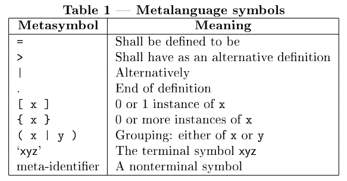

# Notação do Livro


# Pascal é case insensitive
```
BEGIN
  WriteLn('ok');
END.
```

é equivalente a
```
begin
  writeln('ok');
end.
```

- Const: define constantes (valor imutável)

- Type: Define novos tipos baseados noutros

- Var: define espaços de memória que guardam valores


# Identifiers
identifier = letter (letter | digit)*

# Directives
directive = letter (letter | digit)*

Uma directive é uma palavra opcional que pode aparecer dentro de uma declaração de procedimento ou função.
Serve para dar instruções especiais ao compilador sobre aquele subprograma.

No Pascal Standard, só existe uma diretiva permitida: forward

# Números
```
digit-sequence = \d+
scale-factor = sign? digit-sequence
unsigned-integer = digit-sequence
unsigned-real = digit-sequence '.' digit-sequence ([eE] scale-factor)?
               | digit-sequence [eE] scale-factor
sign = '+' | '-'
signed-integer = sign? unsigned-integer
signed-real = sign? unsigned-real
signed-number = signed-integer | signed-real
```

# Labels
- Número inteiro declarado no início de um programa ou procedimento.
- Funciona como um marcador dentro do código.
- Usado apenas com goto, para saltar para aquele ponto do programa.

labels = digit-sequence

Valores válidos: 0 a 9999.

- Só podem ser usados com goto.

- Todo goto X; tem um label X declarado.

Exemplo:

```
program Exemplo;
label 100, 200;
begin
  writeln('Antes do salto');
  goto 100;
  writeln('Isto nunca será executado');
100:
  writeln('Saltei para o label 100');
200:
  writeln('Fim do programa');
end.
```

# Character-strings
Se for só um caracter  é um char

Senão é uma string

# Comentários
No Pascal Standard existem dois estilos de comentários:

- { ... }
- (* ... *)